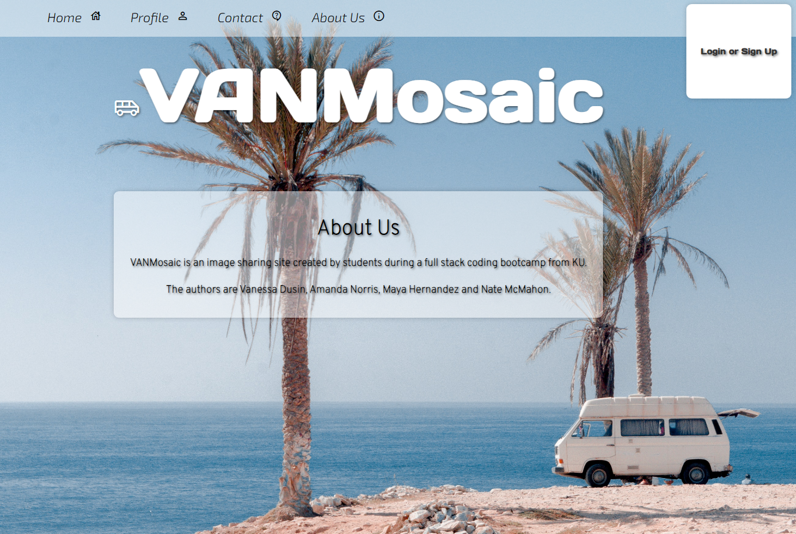

# VANMosaic

## Description
    
VANMosaic is an image sharing app which allows the user to upload images to their profile and see images posted by other users. It has a homepage which displays images posted recently by others. VANMosaic allows users to view recently posted images without logging in/signing up, but requires an account to post new images. Van Mosaic validates user credentials upon logging in and ties posts to the corresponding poster.
    
## Table of Contents
    
- [Installation](#installation)
- [Usage](#usage)
- [Credits](#credits)
- [Questions](#questions)

    
## Installation
    
There is no installation required, simply navigate to the deployed URL and use VANMosaic however you like!
    
## Usage
    
The application uses a Node and Express back end and uses both GET and POST routes for retrieving and adding new data. Images are posted by the user to the DB using Firebase, a photo upload service provided by Google. VANMosaic has a folder structure that meets the MVC paradigm and uses Handlebars.js as the template engine. It is backed by a MySQL database with a Sequelize ORM and protects API keys and sensitive information with environment variables and includes user authentication. VANMosaic is deployed and available using Heroku
    

    
## Credits
    
VANMosaic has four authors: Amanda Norris, Maya Hernandez, Vanessa Dusin and Nate McMahon. We referenced our past Bootcamp course materials along the way

## Questions

If you have any questions, feel free to reach out to VANMosaic's remote GitHub repository:
[github.com/natemcmahon/VANMosaic](github.com/natemcmahonVANMosaic)
